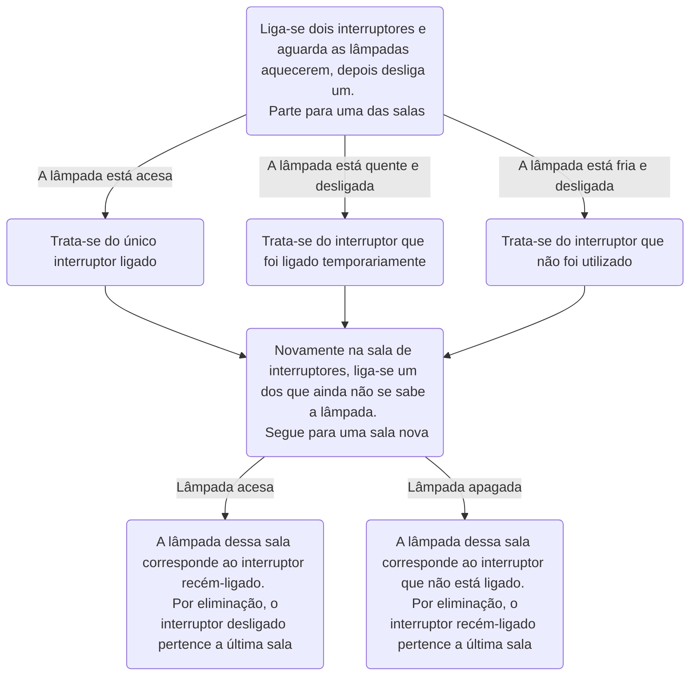

5) Você está em uma sala com três interruptores, cada um conectado a uma lâmpada em salas diferentes. Você não pode ver as lâmpadas da sala em que está, mas pode ligar e desligar os interruptores quantas vezes quiser. Seu objetivo é descobrir qual interruptor controla qual lâmpada. Como você faria para descobrir, usando apenas duas idas até uma das salas das lâmpadas, qual interruptor controla cada lâmpada?
 

Incialmente eu ligaria dois interruptores e aguardaria as lâmpadas esquentarem. 
Após alguns minutos, desligaria um dos interruptores e entraria em uma das salas, verificando a situação da lâmpada presente nela: se estivesse ligada, concluiria que esta pertence ao único interruptor ligado; se estivesse desligada, porém ainda quente, esta seria a que esteve com o interruptor ligado por um tempo e que depois foi desligado; por fim, se a lâmpada estivesse desligada e fria, está conectada ao interruptor desligado e que não tinha sido ligado. 
Desta forma, bastaria eu voltar a sala de interruptores, agora sabendo uma das conexões e, por eliminação, ligar um interruptor ao qual ainda não sei a conexão e ir para uma das salas ainda não exploradas.
Por fim, ao chegar na sala e a lâmpada estiver acesa, o interruptor que acabara de ser ligado pertence a lâmpada e o último interruptor desconhecido deve pertencer a sala restante. Caso a lâmpada estiver apagada, o segundo interruptor que ainda não se sabia pertence àquela sala, e o único interruptor ligado pertence a sala desconhecida.

O gráfico exemplifica o raciocínio:

